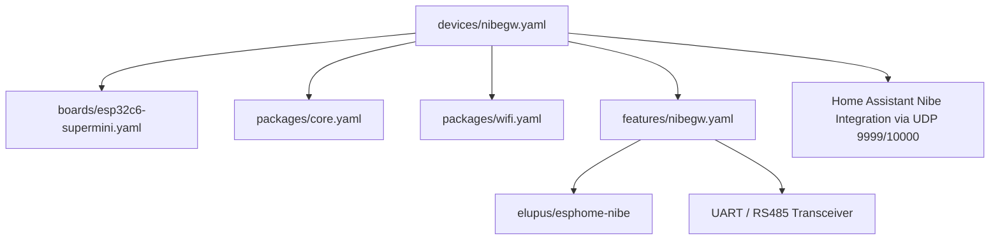

# Architecture Plan: ESPHome Directory Structure & ESP32-C6 NibeGW Configuration

## Overview

This document outlines the recommended directory layout for managing multiple ESP32 boards within [`src/smart-home/esphome/`](src/smart-home/esphome/), starting with the **ESP32-C6 SuperMini** board operating as [`nibegw`](src/smart-home/esphome/devices/nibegw.yaml).

---

## 1. Directory Structure Design

The layout separates **hardware definitions** (boards), **reusable software components** (packages & features), and **instantiated physical nodes** (devices).

```
src/smart-home/esphome/
├── README.md                      # Flashing guide, CLI usage, and board pinout notes
├── secrets.yaml.example           # Secrets template (WiFi, passwords, API keys)
├── packages/                      # Reusable modular packages
│   ├── core.yaml                  # Base ESPHome config (API, OTA, Logger, uptime)
│   ├── wifi.yaml                  # WiFi configuration & fallback AP settings
│   └── status-led.yaml            # Board status LED patterns
├── boards/                        # Hardware board definitions
│   ├── esp32c6-supermini.yaml     # ESP32-C6 SuperMini chip platform & framework settings
│   └── esp32s3-zero.yaml          # Profile for future S3/other boards
├── features/                      # Domain-specific functional integrations
│   ├── nibegw.yaml                # NibeGW component configuration (elupus/esphome-nibe)
│   └── modbus-rtu.yaml            # Generic Modbus RTU bus configuration
└── devices/                       # Active physical nodes (1 file per board instance)
    ├── nibegw.yaml                # SuperMini C6 Nibe heat pump gateway node
    └── living-room-climate.yaml   # Example future sensor node
```

---

## 2. Structural Composition



---

## 3. Configuration Details

### A. Board Profile: [`boards/esp32c6-supermini.yaml`](src/smart-home/esphome/boards/esp32c6-supermini.yaml)
- **Platform:** `esp32`
- **Variant:** `esp32c6`
- **Board:** `esp32-c6-devkitc-1`
- **Framework:** `esp-idf` (or `arduino`)

### B. Node Config: [`devices/nibegw.yaml`](src/smart-home/esphome/devices/nibegw.yaml)
- Combines `boards/esp32c6-supermini.yaml`, `packages/core.yaml`, `packages/wifi.yaml`, and `features/nibegw.yaml`.
- Binds RS485 transceiver pins to ESP32-C6 UART pins (e.g., `tx_pin: GPIO16`, `rx_pin: GPIO17`, `dir_pin: GPIO21`).
- Relays NibeGW UDP frames directly to Home Assistant listening on ports `9999`/`10000`.

---

## 4. Next Steps for Implementation

1. Create directory hierarchy under [`src/smart-home/esphome/`](src/smart-home/esphome/).
2. Populates packages (`packages/core.yaml`, `packages/wifi.yaml`).
3. Create board definition [`boards/esp32c6-supermini.yaml`](src/smart-home/esphome/boards/esp32c6-supermini.yaml).
4. Create Nibe feature integration [`features/nibegw.yaml`](src/smart-home/esphome/features/nibegw.yaml).
5. Define deployable device [`devices/nibegw.yaml`](src/smart-home/esphome/devices/nibegw.yaml).
